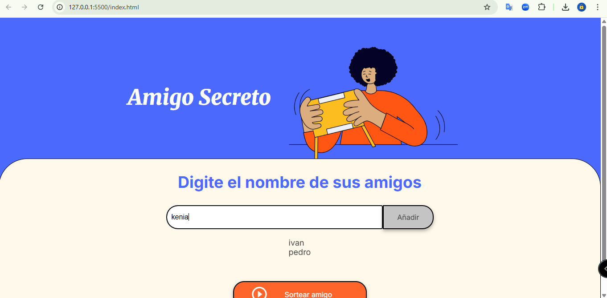
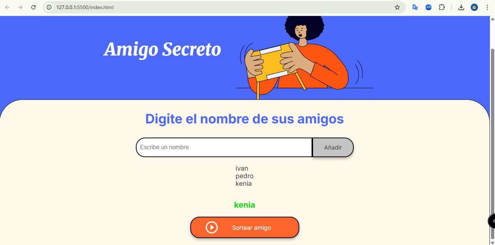

# Desafío Alura - Amigo Secreto

Este desafío consiste en una aplicación que permite a los usuarios ingresar nombres de amigos en una lista, realizar un sorteo aleatorio y determinar quién es el "Amigo Secreto". Los usuarios pueden agregar nombres a través de un campo de texto y un botón "Añadir", visualizar la lista de nombres y, finalmente, hacer clic en "Sortear Amigo" para seleccionar un nombre aleatorio, mostrando el resultado en pantalla.

## Funcionalidades ⚙️

### 1. **Agregar Nombres**
- Los usuarios pueden ingresar nombres en un campo de texto.
- Luego de ingresar el nombre, deben hacer clic en el botón **"Añadir"** para agregar el nombre a la lista.

  
### 2. **Mostrar Lista de Nombres**
- La aplicación debe mostrar todos los nombres ingresados por los usuarios.

### 3. **Sortear Amigo Secreto**
- Los usuarios pueden hacer clic en el botón **"Sortear Amigo"** para realizar un sorteo aleatorio y seleccionar un "Amigo Secreto".
- El nombre seleccionado se mostrará en pantalla como resultado del sorteo.

## Instrucciones de Uso 📋

1. **Agregar Nombres**:
   - Escribe el nombre de un amigo en el campo de texto y haz clic en el botón **"Añadir"**.
   - El nombre aparecerá en la lista de amigos.

2. **Sortear Amigo Secreto**:
   - Una vez que hayas agregado todos los nombres, haz clic en el botón **"Sortear Amigo"**.
   - La aplicación seleccionará aleatoriamente un "Amigo Secreto" de la lista y mostrará el resultado en pantalla.
